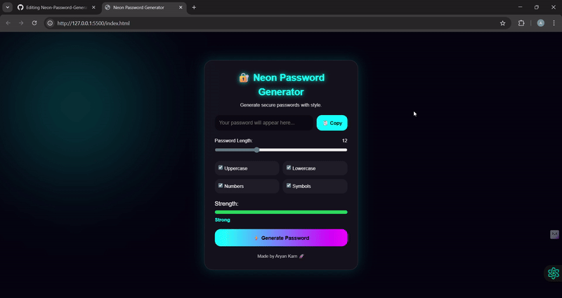
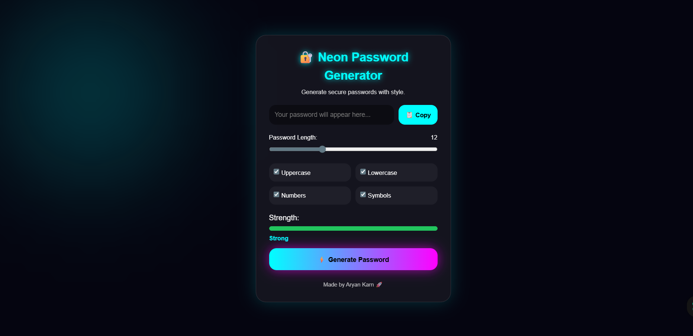

# 🔐 Neon Password Generator

A modern cyberpunk-style password generator built using **HTML, CSS, and JavaScript**.

## 🚀 Features
- Generate secure passwords instantly
- Choose password length using slider
- Options for uppercase, lowercase, numbers, and symbols
- Strength meter (Weak / Medium / Strong)
- Copy to clipboard button
- Neon glowing UI with smooth animations
- Responsive design

## 🛠 Tech Stack
- HTML
- CSS (Neon UI + Animations)
- JavaScript

  ## 🎥 Demo

## 📸 Screenshot

## 🌐 Live Demo
(https://karnaryan-66.github.io/Neon-Password-Generator/)

## 🧠 How It Works

- The slider sets password length dynamically
- Checkboxes pick character sets
- The strength bar changes color & size based on selection
- Copy button copies password to clipboard

---

Made by **Aryan Karn 🚀**
